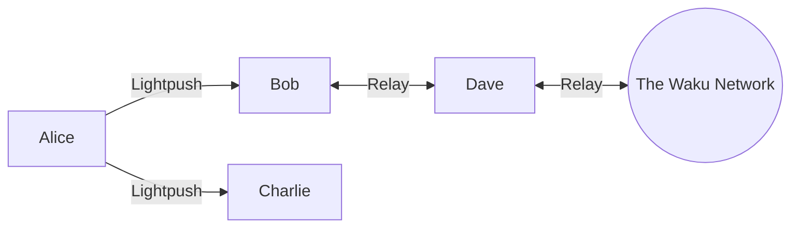

This document describes the testing for the service incentivization PoC for Waku Lightpush.

# Background

Waku provides a suite of light protocols that allow edge nodes to use network services without being full Relay nodes. In particular, the Lightpush protocol allows an edge node (client) to ask a service node to publish a message to the Waku network on its behalf. In order to publish a message to the Waku network, the service node must have an RLN membership. In other words, the Lightpush client asks the service node to spend some of its limited resources. The goal of this PoC is to demonstrate an incentivized setup between a Lightpush edge node and a service node. 

# Service incentivization PoC - functionality overview

This proof-of-concept contains two additional modules: eligibility and reputation.

## Eligibility module

Eligibility allows a service node to determine whether an incoming Lightpush request is _eligible_ to be fulfilled. A request is considered eligible if it contains a _proof of payment_. In this PoC, a proof of payment is a transaction hash (txid) corresponding to a transaction on Linea Sepolia.

The PoC makes the following assumptions:

- the edge node learns off-band what the service node's on-chain address is (i.e., where payment must be made) and what amount is expected;
  
- the payment is made in native tokens (ETH), not in ERC-20 or other contract-based tokens;
  
- each request is paid for separately with its own transaction.
  

A Lightpush request is considered _eligible_ if and only if:

- there is a proof of payment (txid) attached to the request;
  
- the txid corresponds to a confirmed transaction on Linea Sepolia;
  
- the transaction transfers exactly the expected amount to the expected address;
  
- the transaction has not been used in previous requests.
  

## Reputation module

The reputation module allows edge nodes to avoid service nodes that provide poor service.

In this PoC, reputation has three possible values: good, bad, and neutral. The goal of reputation is for the edge node to avoid service nodes that provide bad service. Initially, from the edge node's perspective, all peers have neutral reputation. If an edge node sends an eligible request that is not fulfilled, it marks the respective service node as having "bad reputation". Bad-reputation peers are not selected for future requests. After a successfully fulfilled request, the edge node changes the service node's reputation to "good".

Note: not all error responses lead to a decrease in the service node's reputation. If the request is rejected due to a missing or invalid proof of payment, the service node's reputation remains unchanged. The service node's reputation is decreased only if an _eligible_ request is not served.

### Note on peer selection from peer store vs service peers

There are two ways an edge node can choose a peer to send a Lightpush request to: select from the peer store, or use the peer from the service slot for Lightpush. If an edge node establishes a dedicated connection to a peer via `--lightpushnode`, that peer is put in the service slot for Lightpush. There can only be one peer in the service slot at any given time. If there is a peer in the service slot, all requests go to that peer.

Reputation functionality only applies to peers selected from the peer store (i.e., connected to via `--staticnode`). In the testing scenarios described below, we deliberately avoid using `--lightpushnode` — otherwise, we wouldn't be able to test the reputation-based peer selection logic.

# Prerequisites

This section describes preparatory steps and prerequisites for the testing scenario.

## Linea Sepolia RPC endpoint

It is required to have a Linea Sepolia RPC endpoint that serves two purposes:

- create an RLN membership and generate proofs (as before);
  
- check eligibility proofs (functionality added in this PoC).
  

In this PoC, these are two separate CLI arguments, which may or may not be set to the same RPC endpoint.

## RLN membership

In order to publish a message, a valid RLN membership is needed.

See [`nwaku-compose`](https://github.com/waku-org/nwaku-compose) for RLN registration instructions.

> [!note] 
> As of 2025-07-14, the `register_rln.sh` script from nwaku-compose was used to register a membership on Linea Sepolia, following instructions at commit [`60f9f99`](https://github.com/waku-org/nwaku-compose/commits/60f9f99527915d125dc790ec39b3023d1fd2bc4b), and manually changing the nwaku docker version from `0.36` (not available on Docker Hub at the time of this writing) to `latest`.

## Building from source

To start experimenting with the PoC, check out the [feature branch](https://github.com/waku-org/nwaku/tree/feat/service-incentivization-poc) and build it from source ([instructions](https://docs.waku.org/guides/nwaku/build-source)).

See also: the [REST API reference](https://waku-org.github.io/waku-rest-api/) for `nwaku`.

# Experimental setup

This section describes a local setup containing multiple `nwaku` nodes used to test the PoC.

Nodes are launched on the same machine on different ports. The `--ports-shift` CLI argument for `nwaku` shifts all ports by a given value. 
Note that REST API commands must use the appropriate port.

Our setup includes the following nodes:

- Alice — the edge node that wants to publish messages without being connected to Relay.
  
- Bob — the service node that fulfills Alice's request.
  
- Charlie — the alternative service node that fails to fulfill Alice's request.
  
- Dave — the node that Bob connects to via Relay to publish Alice's message.



For reproducibility, it is recommended to launch nodes with the same (static) keys (by default, new keys are generated at each launch). 
Example commands use the pre-generated constant keys from which node IDs are derived. 
Instructions for key config can be found [here](https://github.com/waku-org/nwaku/blob/master/docs/operators/how-to/configure-key.md).

Nodes are as follows:

|Name|Protocols enabled|Node key|Node ID|Ports shift|TCP port|REST API port|
|---|---|---|---|---|---|---|
|Alice|Lightpush (client)|`17950ef7510db19197ec0e3d34b41c0ed60bb7a0a619aa504eb6689c85ca9925`|`16Uiu2HAkwxC5Mcsh2DyZBq8CiKqnDkLUHWTuXCJas3TMPmRkynWz`|1|60001|8646|
|Bob|Relay, Lightpush (server)|`2bd3bbef1afa198fc614a254367de5ae285d799d7b1ba6d9d8543ba41038bbed`|`16Uiu2HAmVHRbXuE4MUZbZ4xXF5CnVT5ntNGS3z7ER1fX1aLjxE95`|0|60000|8645|
|Charlie|Relay|`fbfa8c3e38e7594500e9718b8c800e2d1a3ef5bc65ce041adf788d276035230f`|`16Uiu2HAkyxHKziUQghTarGhBSFn8GcVapDgkJjMFTUVCCfEuyzSd`|3|60003|8648|
|Dave|Relay|`166aee32c415fe796378ca0336671f4ec1fa26648857a86a237e509aaaeb1980`|`16Uiu2HAmSCUwvwDnXm7PyVbtKiQ5xzXb36wNw8YbGQxcBuxWTuU8`|2|60002|8647|

> [!note] 
> Nodes do not save eligibility and reputation data between restarts.


## Testing scenario

The following suggested testing scenario demonstrates eligibility- and reputation-related functionality.

First, set the following environmental variables (replace `API_KEY` with your Infura API key, or use an alternative RPC provider):
```
export ALICE_NODEKEY="17950ef7510db19197ec0e3d34b41c0ed60bb7a0a619aa504eb6689c85ca9925"
export BOB_NODEKEY="2bd3bbef1afa198fc614a254367de5ae285d799d7b1ba6d9d8543ba41038bbed"
export CHARLIE_NODEKEY="fbfa8c3e38e7594500e9718b8c800e2d1a3ef5bc65ce041adf788d276035230f"
export DAVE_NODEKEY="166aee32c415fe796378ca0336671f4ec1fa26648857a86a237e509aaaeb1980"

export CHARLIE_MULTIADDR="/ip4/127.0.0.1/tcp/60003/p2p/16Uiu2HAkyxHKziUQghTarGhBSFn8GcVapDgkJjMFTUVCCfEuyzSd"
export DAVE_MULTIADDR="/ip4/127.0.0.1/tcp/60002/p2p/16Uiu2HAmSCUwvwDnXm7PyVbtKiQ5xzXb36wNw8YbGQxcBuxWTuU8"

export RLN_RELAY_ETH_CLIENT_ADDRESS="https://linea-sepolia.infura.io/v3/API_KEY"
export RLN_RELAY_CRED_PATH=".keystore/rlnKeystore-linea-sepolia.json"
export RLN_RELAY_CRED_PASSWORD="12345678"

export ELIGIBILITY_ETH_CLIENT_ADDRESS="https://linea-sepolia.infura.io/v3/API_KEY"

export ELIGIBILITY_RECEIVER_ADDRESS="0x6298cc1831B6E5eDEDA5cC73bc75a040108358Bb"
export ELIGIBILITY_PAYMENT_AMOUNT_WEI="1000000000"

```

1. Launch Charlie (an isolated service node).
```
./build/wakunode2 --lightpush --rln-relay-tree-path=~/.waku/rln-tree-db-3 --nodekey=$CHARLIE_NODEKEY --discv5-discovery=false --dns-discovery=false --rest=true --rest-admin=true --rest-address=127.0.0.1 --ports-shift=3 --rest-allow-origin="*" --preset=twn --relay=true --nat=upnp --rln-relay-eth-client-address=$RLN_RELAY_ETH_CLIENT_ADDRESS --rln-relay-cred-password=$RLN_RELAY_CRED_PASSWORD --rln-relay-cred-path=$RLN_RELAY_CRED_PATH --log-level=DEBUG --eligibility-enabled=true --eligibility-eth-client-address=$ELIGIBILITY_ETH_CLIENT_ADDRESS --eligibility-receiver-address=$ELIGIBILITY_RECEIVER_ADDRESS --eligibility-payment-amount-wei=$ELIGIBILITY_PAYMENT_AMOUNT_WEI
```

> [!note]
> When launching Charlie, we **must** enable Relay, otherwise eligibility module will not activate. To enforce node isolation, we turn off all discovery methods and provide no explicit nodes to connect to. This ensures that while Charlie's enable protocols theoretically allow him to fulfill Alice's Lightpush request, in practice the request would fail, which is what we need for negative test cases.


2. Launch Alice (an edge node) connected to Charlie.

```
./build/wakunode2 --nodekey=$ALICE_NODEKEY --staticnode=$CHARLIE_MULTIADDR --rest=true --rest-admin=true --rest-address=127.0.0.1 --ports-shift=1 --rest-allow-origin="*" --rln-relay=false --relay=false --cluster-id=1 --discv5-discovery=false --dns-discovery=false --reputation-enabled --log-level=DEBUG
```

3. Alice sends a series of ineligible requests (without proof of payment and with invalid proof of payment).
	1. Charlie is selected as service node (it is the only peer with neutral reputation Alice is aware of).
	2. All ineligible requests are rejected, Alice receives error messages, Charlie's reputation remains unchanged.


> [!note]
> In all experiments, we explicitly use pubsub topic `waku/2/rs/1/0` i.e. shard `0` on The Waku Network. `%2Fwaku%2F2%2Frs%2F1%2F0` is an encoding of `/waku/2/rs/1/0` - the pubsub topic (i.e. identifier) of shard `0`.

REST API request from Alice without proof of payment:
```
curl -X POST "http://127.0.0.1:8646/lightpush/v3/message" -H "accept: application/json" -H "Content-Type: application/json" -d '{ "pubsubTopic": "/waku/2/rs/1/0", "message": { "payload": "SGVsbG8gV29ybGQ=", "contentTopic": "/i13n-poc/1/chat/proto" } }'
```

Expected response:
```
{"statusDesc":"Eligibility proof is required"}
```

REST API request from Alice with a non-existent transaction as proof of payment:
```
curl -X POST "http://127.0.0.1:8646/lightpush/v3/message" -H "accept: application/json" -H "Content-Type: application/json" -d '{ "pubsubTopic": "/waku/2/rs/1/0", "message": { "payload": "SGVsbG8gV29ybGQ=", "contentTopic": "/i13n-poc/1/chat/proto" }, "eligibilityProof": "0x0000000000000000000000000000000000000000000000000000000000000000" }'
```

Expected response:
```
{"statusDesc":"Eligibility check failed: Failed to fetch tx or tx receipt"}
```

REST API request form Alice with a transaction with incorrect amount (higher than expected):
```
curl -X POST "http://127.0.0.1:8646/lightpush/v3/message" -H "accept: application/json" -H "Content-Type: application/json" -d '{ "pubsubTopic": "/waku/2/rs/1/0", "message": { "payload": "SGVsbG8gV29ybGQ=", "contentTopic": "/i13n-poc/1/chat/proto" }, "eligibilityProof": "0x0a502f0a367f99b50e520afeb3843ee9e0f73fd0f01d671829c0c476d86859df" }'
```

Expected response:
```
{"statusDesc":"Eligibility check failed: Wrong tx value: got 2000000000, expected 1000000000"}
```

>[!note]
>The amount must be exactly as expected, counted in wei. In the PoC currently, exceeding amounts are also rejected.

REST API request from Alice with a transaction with incorrect amount (lower than expected):

```
curl -X POST "http://127.0.0.1:8646/lightpush/v3/message" -H "accept: application/json" -H "Content-Type: application/json" -d '{ "pubsubTopic": "/waku/2/rs/1/0", "message": { "payload": "SGVsbG8gV29ybGQ=", "contentTopic": "/i13n-poc/1/chat/proto" }, "eligibilityProof": "0xa3c5da96b234518ae544c3449344cf4216587f400a529a836ce6131a82228363" }'
```

Expected response:
```
{"statusDesc":"Eligibility check failed: Wrong tx value: got 900000000, expected 1000000000"}
```

> [!note]
> All failed responses mentioned above must not affect Charlie's reputation from Alice's point of view, which is reflected in Alice's log with lines like: `DBG 2025-07-10 16:30:46.623+02:00 Neutral response - reputation unchanged for peer tid=25598 file=reputation_manager.nim:63 peer=16U*EuyzSd`.

4. Alice sends an eligible request.
	1. Charlie is again selected as service node.
	2. Charlie fails to fulfill the request due to being isolated.
	3. Alice receives an error message and sets Charlie's reputation to "bad".

REST API request from Alice with a valid proof of payment:
```
curl -X POST "http://127.0.0.1:8646/lightpush/v3/message" -H "accept: application/json" -H "Content-Type: application/json" -d '{ "pubsubTopic": "/waku/2/rs/1/0", "message": { "payload": "SGVsbG8gV29ybGQ=", "contentTopic": "/i13n-poc/1/chat/proto" }, "eligibilityProof": "0x67932980dd5e66be76d4d096f3e176b2f1590cef3aa9981decb8f59a5c7e60e3" }'
```

Expected response:
```
{"statusDesc":"No peers for topic, skipping publish"}
```

Alice assigns bad reputation to Charlie because a valid request was not served (check Alice's logs for lines like this):
```
DBG 2025-07-10 16:33:00.897+02:00 Assign bad reputation for peer       tid=25598 file=reputation_manager.nim:57 peer=16U*EuyzSd
```

5. Launch Dave (a Relay node connected to the Waku network).

```
./build/wakunode2 --rln-relay-tree-path=~/.waku/rln-tree-db-2 --nodekey=166aee32c415fe796378ca0336671f4ec1fa26648857a86a237e509aaaeb1980 --rest=true --rest-admin=true --rest-address=127.0.0.1 --rest-allow-origin="*" --preset=twn --relay=true --nat=upnp --ports-shift=2 --rln-relay-eth-client-address=$RLN_RELAY_ETH_CLIENT_ADDRESS --log-level=DEBUG
```

> [!note]
> Even if Dave cannot connect to The Waku Network due to peer discovery issues, it is sufficient for Alice's message to be propagated to just one node (in this scenario, from Bob to Dave) for the request to be considered successfully fulfilled.

6. Launch Bob (a Relay node connected to Dave).

```
./build/wakunode2 --lightpush --rln-relay-tree-path=~/.waku/rln-tree-db --nodekey=$BOB_NODEKEY --staticnode=$DAVE_MULTIADDR --discv5-discovery=false --dns-discovery=false --rest=true --rest-admin=true --rest-address=127.0.0.1 --rest-port=8645 --rest-allow-origin="*" --preset=twn --relay=true --nat=upnp --rln-relay-eth-client-address=$RLN_RELAY_ETH_CLIENT_ADDRESS --rln-relay-cred-password=$RLN_RELAY_CRED_PASSWORD --rln-relay-cred-path=$RLN_RELAY_CRED_PATH --log-level=DEBUG --eligibility-enabled=true --eligibility-eth-client-address=$ELIGIBILITY_ETH_CLIENT_ADDRESS --eligibility-receiver-address=$ELIGIBILITY_RECEIVER_ADDRESS --eligibility-payment-amount-wei=$ELIGIBILITY_PAYMENT_AMOUNT_WEI
```

7. Connect Alice to Bob (via REST API, without re-launching).

```
curl -X POST "http://127.0.0.1:8646/admin/v1/peers" -H "accept: text/plain" -H "content-type: application/json" -d '["/ip4/127.0.0.1/tcp/60000/p2p/16Uiu2HAmVHRbXuE4MUZbZ4xXF5CnVT5ntNGS3z7ER1fX1aLjxE95"]'
```

> [!todo]
> Figure out how to use an environment variable inside `-d '[""]'` here.

Verify that Alice is connected to Bob:

```
curl -X GET "http://127.0.0.1:8646/admin/v1/peers/connected" | jq . | grep multiaddr
```

Expected response (both Bob's and Charlie's node IDs must appear here; a real IP address replaced with `EXTERNAL_IP`):
```
  "multiaddr": "/ip4/EXTERNAL_IP/tcp/60000/p2p/16Uiu2HAmVHRbXuE4MUZbZ4xXF5CnVT5ntNGS3z7ER1fX1aLjxE95",
  "multiaddr": "/ip4/EXTERNAL_IP/tcp/60003/p2p/16Uiu2HAkyxHKziUQghTarGhBSFn8GcVapDgkJjMFTUVCCfEuyzSd",
```

8. Alice sends an eligible request. Expected behavior:
	1. Bob is selected (even though Alice is also aware of Charlie, Charlie is excluded due to its bad reputation).
	2. Bob serves the request and returns a success message to Alice.
	3. Alice sets Bob's reputation to "good".

```
curl -X POST "http://127.0.0.1:8646/lightpush/v3/message" -H "accept: application/json" -H "Content-Type: application/json" -d '{ "pubsubTopic": "/waku/2/rs/1/0", "message": { "payload": "SGVsbG8gV29ybGQ=", "contentTopic": "/i13n-poc/1/chat/proto" }, "eligibilityProof": "0x67932980dd5e66be76d4d096f3e176b2f1590cef3aa9981decb8f59a5c7e60e3" }'
```

Expected response (indicates successful publishing of the message):
```
{"relayPeerCount":1}
```

Alice's log must also contain lines like the following. This shows that even though Alice is aware of two potential peers to select for her request, due to reputation system, only one peer (Bob) is considered. Moreover, Bob initially has a neutral (`none(bool)`) reputation because Alice hasn't had any interaction with Bob yet:
```
DBG 2025-07-10 16:42:24.575+02:00 Before filtering - total peers:      topics="waku node peer_manager" tid=25598 file=peer_manager.nim:253 numPeers=2
DBG 2025-07-10 16:42:24.576+02:00 Reputation enabled: consider only non-negative reputation peers topics="waku node peer_manager" tid=25598 file=peer_manager.nim:256
DBG 2025-07-10 16:42:24.576+02:00 Pre-selected peers from peerstore:     topics="waku node peer_manager" tid=25598 file=peer_manager.nim:272 numPeers=1
DBG 2025-07-10 16:42:24.576+02:00 Selected peer has reputation        topics="waku node peer_manager" tid=25598 file=peer_manager.nim:280 reputation=none(bool)
```

Upon successful request handling, a line like this must appear in Alice's log, which shows that Alice has assigned a good reputation to Bob following his successful handling of her request:
```
DBG 2025-07-10 16:42:25.457+02:00 Assign good reputation for peer      tid=25598 file=reputation_manager.nim:60 peer=16U*LjxE95
```

9. Alice sends an ineligible request with a double-spend attempt (trying to reuse a txid twice).
	1. Bob is again selected as service peer.
	2. Bob rejects the request and returns a corresponding error message.
	3. Alice doesn't change Bob's reputation.

REST API request (same as the first eligible request, with the same txid):
```
curl -X POST "http://127.0.0.1:8646/lightpush/v3/message" -H "accept: application/json" -H "Content-Type: application/json" -d '{ "pubsubTopic": "/waku/2/rs/1/0", "message": { "payload": "SGVsbG8gV29ybGQ=", "contentTopic": "/i13n-poc/1/chat/proto" }, "eligibilityProof": "0x67932980dd5e66be76d4d096f3e176b2f1590cef3aa9981decb8f59a5c7e60e3" }'
```

Expected response:
```
{"statusDesc":"Eligibility check failed: TxHash 0x67932980dd5e66be76d4d096f3e176b2f1590cef3aa9981decb8f59a5c7e60e3 was already checked (double-spend attempt)"}
```

10. Verify, on Dave's node, that Alice's message has indeed reached Dave.

Get latest messages on shard `0`:
```
curl -X GET "http://127.0.0.1:8647/relay/v1/messages/%2Fwaku%2F2%2Frs%2F1%2F0"
```

Expected response (truncated; `i13n-poc` is short for "incentivization proof-of-concept"):
```
[{"payload":"SGVsbG8gV29ybGQ=","contentTopic":"/i13n-poc/1/chat/proto","version":0,"timestamp":1752158544577207808,"ephemeral":false, ....
```

# Eligibility parameters and txids on Linea Sepolia

Transactions have been confirmed on Linea Sepolia for testing purposes.

Transaction IDs with correct amount (should succeed if the service node is connected to at least one other node):

```
0x67932980dd5e66be76d4d096f3e176b2f1590cef3aa9981decb8f59a5c7e60e3
0x7dff359c2eda52945f278341d056049510110030ac9545448762b70490eb6260
0x3c93f0e5f18667dce2dd99253152253a05bc42ff48140c21107c5d6a891d1a29
0xb5b7230a2eacfb70238843feb26ace80f01500376eb7b976f4757b0f1429e5d0
0x4bdfdc1019a6e8a0d098e59592f076d50b54d7a7e18f86a0f758eb8c6e9e96b7
```

Transaction IDs to the expected address with wrong amount (must fail regardless of the service node's connection status and return the appropriate error):

```
0x0a502f0a367f99b50e520afeb3843ee9e0f73fd0f01d671829c0c476d86859df
0x0a502f0a367f99b50e520afeb3843ee9e0f73fd0f01d671829c0c476d86859df
```

Transaction ID to the wrong address with the correct amount (must fail):
```
0x8a7548b4552dea4e6ef1a3d7b13a0ab9759b5be0ce3f6599d28d04c3aaa1fa1e
```

Transaction ID that doesn't correspond to a confirmed transaction (must fail):
```
0x0000000000000000000000000000000000000000000000000000000000000000
```


