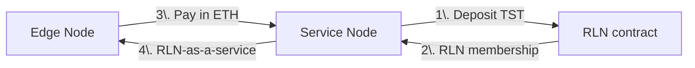
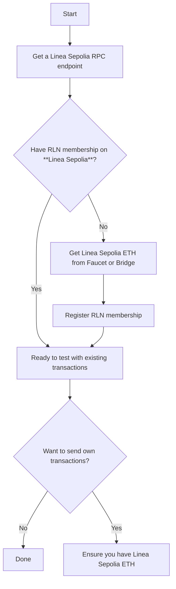
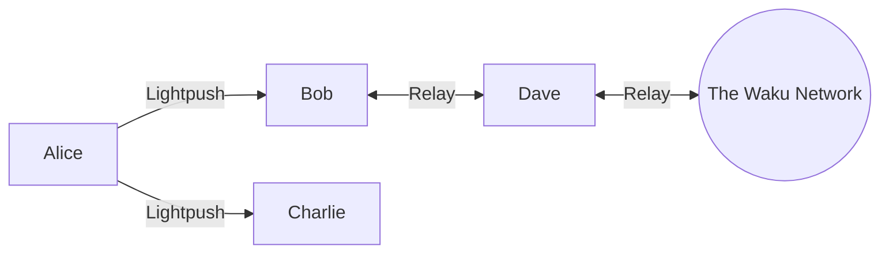

This document describes the testing for the service incentivization PoC for Waku Lightpush.

# Background

Waku provides a suite of light protocols that allow edge nodes to access network services without operating as full Relay nodes. Specifically, the Lightpush protocol enables an edge node (client) to request a service node to publish a message to the Waku network on its behalf. To do this, the service node must possess an RLN membership. In essence, the Lightpush client is asking the service node to expend a portion of its limited resources. The objective of this PoC is to demonstrate an incentivized setup between a Lightpush edge node and a service node.

# Functionality Overview

This proof-of-concept introduces two additional modules: eligibility and reputation.

## Eligibility Module

The eligibility module allows a service node to determine whether an incoming Lightpush request is _eligible_ for fulfillment. A request is considered eligible if it includes a _proof of payment_. In this PoC, the proof of payment is a transaction hash (txid) that corresponds to a transaction on Linea Sepolia.

The PoC operates under the following assumptions:
- The edge node obtains, off-band, the on-chain address of the service node (i.e., the payment destination) and the expected payment amount;
- Payments are made in native tokens (ETH), not ERC-20 or other contract-based tokens;
- Each request is individually paid for with a unique transaction.

A Lightpush request is deemed _eligible_ if and only if:
- A proof of payment (txid) is attached to the request;
- The txid corresponds to a confirmed transaction on Linea Sepolia;
- The transaction transfers exactly the expected amount to the correct address;
- The transaction has not been used in any previous successful requests.

## Reputation Module

The reputation module enables edge nodes to avoid service nodes that deliver poor service.

Reputation can take on one of three values: good, bad, or neutral. Initially, all peers are considered to have neutral reputation from the edge node's perspective. If an edge node sends an eligible request that is not fulfilled, the respective service node is marked with a "bad" reputation. Peers with bad reputation are excluded from future requests. If a request is successfully fulfilled, the edge node updates the service node's reputation to "good".

Not all error responses affect the service node's reputation. If a request is rejected due to a missing or invalid proof of payment, the service node's reputation remains unchanged. Reputation is downgraded only in the event of a server-side error (corresponding to `5xx` error codes).

Reputation functionality only applies to peers selected from the peer store (i.e., those connected via `--staticnode`). An edge node can choose a peer for Lightpush requests in one of two ways: select from the peer store, or use the peer assigned to the Lightpush service slot. If an edge node explicitly connects to a peer via `--lightpushnode`, that peer occupies the Lightpush service slot. Only one peer can occupy this slot at any given time. When a peer is in the service slot, all Lightpush requests are directed to it. In the testing scenarios below, we intentionally avoid using `--lightpushnode` to ensure we can evaluate the reputation-based peer selection logic.

# Prerequisites

The testing setup (described below) involves Edge Nodes and Service Nodes. An Edge Node sends messages via Lightpush using a Service Node. If the request is eligible, the Service Node uses its RLN membership to publish the Edge Node's message.

> [!warning] 
> As of 2025-07-28, registering new RLN memberships on Linea Sepolia is temporarily unavailable. You can only reproduce the testing scenario if you already have an RLN membership. This guide will be updated when the issue is resolved.

There are two tokens involved (both on Linea Sepolia):
- **TST (Testing Stable Token)**: a custom ERC-20 token on Linea Sepolia, required to register an RLN membership;
- **Linea Sepolia ETH**: native tokens used by the edge node to pay the service node.

The payment and service relationships are illustrated in the following diagram:



You have two options:
1. Reproduce the testing scenario as-is using existing confirmed proof-of-payment transactions;
2. Send your own transactions.

Use the flowchart and table below to determine the prerequisites based on your testing scenario.

| Goal                                                                   | Required Components                                    | Optional / Conditional Steps                                                                                       |
| ---------------------------------------------------------------------- | ------------------------------------------------------ | ------------------------------------------------------------------------------------------------------------------ |
| **Reproduce the scenario with existing transactions**                  | • Linea Sepolia RPC endpoint<br>• RLN membership       | If you **don’t** have RLN membership:<br>• Get Linea Sepolia ETH<br>• Mint TST tokens<br>• Register RLN membership |
| **Reproduce the scenario with your own proof-of-payment transactions** | All of the above + Linea Sepolia ETH (for sending txs) | Get Linea Sepolia ETH:<br>• From faucet **or**<br>• By bridging from Ethereum Sepolia                              |



The next sub-sections provide more detailed instructions for each prerequisite.

## Get a Linea Sepolia RPC Endpoint

Refer to the [official list of node providers](https://docs.linea.build/get-started/tooling/node-providers) on the Linea website.

A Linea Sepolia RPC endpoint is needed for two main purposes:
- to create an RLN membership and generate proofs (as before);
- to check eligibility proofs (functionality introduced in this PoC).

For extensibility, the PoC uses separate configuration parameters for each of these purposes. You may use the same or different RPC endpoints for each.

## Get Linea Sepolia ETH

You can obtain Linea Sepolia ETH in several ways:
1. Request ETH directly from a faucet (see [list of faucets](https://docs.linea.build/get-started/how-to/get-testnet-eth));  
2. Bridge Ethereum Sepolia ETH to Linea Sepolia ETH (see [native bridge](https://linea.build/hub/bridge/native-bridge) — ensure "Show Test Networks" is enabled in the settings);  
3. Ask a friend or colleague for Linea Sepolia ETH (or Ethereum Sepolia ETH, which you can then bridge as described above).

## Register RLN Membership

To publish a message, a valid RLN membership is required. The recommended approach is to use the `register_rln.sh` script from [`nwaku-compose`](https://github.com/waku-org/nwaku-compose). This script both mints TST tokens (required for RLN deposit) and registers an RLN membership in a single step. If using `register_rln.sh`, there is no need to separately mint TST tokens.

We recommend the following directory structure (you will need both `nwaku` and `nwaku-compose` repositories):

```
- nwaku-poc-testing
	- nwaku-compose
	- nwaku
```

> [!note] 
> You will clone the `nwaku-compose` repository in addition to the `nwaku` repository. This setup uses `nwaku-compose` only for its RLN registration script. We **do not** run `nwaku` via `docker compose`, which is `nwaku-compose`’s primary function. Instead, after registering the RLN membership, `nwaku` is run directly from a source-built binary.

Clone the `nwaku-compose` repository:

```
git clone git@github.com:waku-org/nwaku-compose.git
cd nwaku-compose
```

Copy the environment file template and open it for editing:

```
cp .env.example .env
nano .env
```

> [!note] 
> You may use any text editor in place of `nano`.

Edit the `.env` file with the following required parameters:

| Parameter                      | Comment                                                                                |
| ------------------------------ | -------------------------------------------------------------------------------------- |
| `RLN_RELAY_ETH_CLIENT_ADDRESS` | The Linea Sepolia RPC URL endpoint (no quotes).                                        |
| `ETH_TESTNET_ACCOUNT`          | The Linea Sepolia account for which the RLN membership will be registered (no quotes). |
| `ETH_TESTNET_KEY`              | The private key for `ETH_TESTNET_ACCOUNT`, without the `0x` prefix (no quotes).        |
| `RLN_RELAY_CRED_PASSWORD`      | A password to protect your RLN membership (in double quotes).                          |

> [!note] 
> `ETH_TESTNET_KEY` must be the private key corresponding to `ETH_TESTNET_ACCOUNT`.

> [!warning] 
> Be careful not to expose private keys that secure real value (including on other networks). See [how to export your private key](https://support.metamask.io/configure/accounts/how-to-export-an-accounts-private-key/) from Metamask.

Run the script that registers an RLN membership and stores the keys in the keystore:

```
./register_rln.sh
```

If successful, you will see output similar to the following:

```
INF 2025-07-25 10:11:32.243+00:00 credentials persisted           topics="rln_keystore_generator" tid=1 file=rln_keystore_generator.nim:119 path=/keystore/keystore.json
```

Change the ownership of the keystore so it can be accessed later from the `nwaku` directory:

```
sudo chown -R $USER:$USER keystore
```

This keystore will be used in the upcoming testing steps.

> [!note] 
> From this point forward, `nwaku-compose` is no longer needed. All subsequent steps assume you are using the `wakunode2` binary built from source.

Return to the outer directory:

```
cd ../
```

## Build `nwaku` from Source

To use the PoC, you must build `wakunode2` from source using the corresponding feature branch.

Clone the repository and check out the [`feat/service-incentivization-poc`](https://github.com/waku-org/nwaku/tree/feat/service-incentivization-poc) feature branch:

```
git clone git@github.com:waku-org/nwaku.git
cd nwaku
git checkout feat/service-incentivization-poc
```

Build `wakunode2` from source (refer also to the [official build instructions](https://docs.waku.org/guides/nwaku/build-source)):

```
make update
make wakunode2
```

> [!note]
> To speed up the build process, you can pass the `-j` parameter to use multiple CPU cores in parallel. For example, `make -j20 wakunode2` will use 20 cores.

Verify that the binary was built successfully:

```
./build/wakunode2 --version
```

Expected output (values may vary — we only check that the binary exists and runs):

```
version / git commit hash: v0.35.1-167-g248757
[Summary] 0 tests run (0.00s): 0 OK, 0 FAILED, 0 SKIPPED
```

# Experimental Setup Overview

This section describes a local setup involving multiple `nwaku` nodes used to test the PoC.

The setup consists of four nodes, each running on the same machine but using different ports.  When issuing REST API commands, ensure you use the correct port corresponding to the targeted node.

Each node is defined by a set of parameters, either as CLI arguments or via a TOML configuration file.  The config files for all four nodes are located in the `./i13n-poc-configs/toml` directory.  CLI arguments always override configuration parameters from the TOML files.

The experimental setup includes the following nodes:
- **Alice** — an edge node that wants to publish messages without being connected to Relay.
- **Bob** — a service node that fulfills Alice's Lightpush request.
- **Charlie** — an alternative service node that fails to fulfill Alice's request.
- **Dave** — a Relay-connected node that Bob uses to relay Alice's message to the network.



For reproducibility, all nodes are launched with static (pre-generated) keys defined in their config files.  These static keys are used in example commands and determine the node IDs.  For details on configuring node keys, refer to the [key configuration guide](https://github.com/waku-org/nwaku/blob/master/docs/operators/how-to/configure-key.md).

> [!note]  
> In this testing setup, Bob and Charlie share on-chain credentials and the same RLN membership (i.e., the same keystore).

> [!note]  
> Nodes do not persist eligibility or reputation data between restarts.

# Testing Scenario

## Set environment variables

Make a file called `wakunode2.env` in your project root (or home directory):

```
nano ./i13n-poc-configs/envvars.env
```

In the environment file, set the necessary environment variables (`RLN_RELAY_CRED_PASSWORD` is your RLN password). If you use another RPC provider, replace `ELIGIBILITY_ETH_CLIENT_ADDRESS` or `RLN_RELAY_ETH_CLIENT_ADDRESS` accordingly (provide your API key if necessary):
```
export ELIGIBILITY_ETH_CLIENT_ADDRESS="https://rpc.sepolia.linea.build/"
export RLN_RELAY_ETH_CLIENT_ADDRESS="https://rpc.sepolia.linea.build/"
export RLN_RELAY_CRED_PATH="../nwaku-compose/keystore/keystore.json"
export RLN_RELAY_CRED_PASSWORD=RLN_RELAY_CRED_PASSWORD
```

> [!warning]
> If you have moved the keystore from `nwaku-compose`, change `RLN_RELAY_CRED_PATH` accordingly.

## Launch nodes

Make node-launching scripts executable:

```
chmod +x ./i13n-poc-configs/*.sh
```

Launch nodes in different terminal windows (**in this order** — important for proper connection establishment):

```
./i13n-poc-configs/run_charlie.sh
```

```
./i13n-poc-configs/run_alice.sh
```

```
./i13n-poc-configs/run_dave.sh
```

```
./i13n-poc-configs/run_bob.sh
```

## Run the testing scenario

To communicate with Waku nodes, use REST API interface (see [REST API reference](https://waku-org.github.io/waku-rest-api/)).

### Alice is only connected to Charlie

Initially, Alice is only connected to Charlie. We test negative scenarios when Alice's requests cannot be fulfilled. We will connect Alice to Bob later in the scenario.

#### Alice sends ineligible requests, Charlie denies

Alice sends a series of ineligible requests (without proof of payment and with invalid proof of payment).
1. Charlie is selected as service node (it is the only peer with neutral reputation Alice is aware of).
2. All ineligible requests are rejected, Alice receives error messages, Charlie's reputation remains unchanged.

> [!note]
> In all experiments, we explicitly use pubsub topic `waku/2/rs/1/0` i.e. shard `0` on The Waku Network. `%2Fwaku%2F2%2Frs%2F1%2F0` is an encoding of `/waku/2/rs/1/0` - the pubsub topic (i.e. identifier) of shard `0`.

REST API request from Alice without proof of payment:
```
curl -X POST "http://127.0.0.1:8646/lightpush/v3/message" -H "accept: application/json" -H "Content-Type: application/json" -d '{ "pubsubTopic": "/waku/2/rs/1/0", "message": { "payload": "SGVsbG8gV29ybGQ=", "contentTopic": "/i13n-poc/1/chat/proto" } }'
```

Expected response:
```
{"statusDesc":"Eligibility proof is required"}
```

REST API request from Alice with a non-existent transaction as proof of payment:
```
curl -X POST "http://127.0.0.1:8646/lightpush/v3/message" -H "accept: application/json" -H "Content-Type: application/json" -d '{ "pubsubTopic": "/waku/2/rs/1/0", "message": { "payload": "SGVsbG8gV29ybGQ=", "contentTopic": "/i13n-poc/1/chat/proto" }, "eligibilityProof": "0x0000000000000000000000000000000000000000000000000000000000000000" }'
```

Expected response:
```
{"statusDesc":"Eligibility check failed: Failed to fetch tx or tx receipt"}
```

REST API request form Alice with a transaction with incorrect amount (higher than expected):
```
curl -X POST "http://127.0.0.1:8646/lightpush/v3/message" -H "accept: application/json" -H "Content-Type: application/json" -d '{ "pubsubTopic": "/waku/2/rs/1/0", "message": { "payload": "SGVsbG8gV29ybGQ=", "contentTopic": "/i13n-poc/1/chat/proto" }, "eligibilityProof": "0x0a502f0a367f99b50e520afeb3843ee9e0f73fd0f01d671829c0c476d86859df" }'
```

Expected response:
```
{"statusDesc":"Eligibility check failed: Wrong tx value: got 2000000000, expected 1000000000"}
```

>[!note]
>The amount must be exactly as expected, counted in wei. In the PoC currently, exceeding amounts are also rejected.

REST API request from Alice with a transaction with incorrect amount (lower than expected):

```
curl -X POST "http://127.0.0.1:8646/lightpush/v3/message" -H "accept: application/json" -H "Content-Type: application/json" -d '{ "pubsubTopic": "/waku/2/rs/1/0", "message": { "payload": "SGVsbG8gV29ybGQ=", "contentTopic": "/i13n-poc/1/chat/proto" }, "eligibilityProof": "0xa3c5da96b234518ae544c3449344cf4216587f400a529a836ce6131a82228363" }'
```

Expected response:
```
{"statusDesc":"Eligibility check failed: Wrong tx value: got 900000000, expected 1000000000"}
```

> [!note]
> All failed responses mentioned above must not affect Charlie's reputation from Alice's point of view, which is reflected in Alice's log with lines like: `DBG 2025-07-10 16:30:46.623+02:00 Neutral response - reputation unchanged for peer tid=25598 file=reputation_manager.nim:63 peer=16U*EuyzSd`.

#### Alice sends an eligible request, Charlie fails to fulfill it

Alice sends an eligible request.
1. Charlie is again selected as service node.
2. Charlie fails to fulfill the request due to being isolated.
3. Alice receives an error message and sets Charlie's reputation to "bad".

REST API request from Alice with a valid proof of payment:
```
curl -X POST "http://127.0.0.1:8646/lightpush/v3/message" -H "accept: application/json" -H "Content-Type: application/json" -d '{ "pubsubTopic": "/waku/2/rs/1/0", "message": { "payload": "SGVsbG8gV29ybGQ=", "contentTopic": "/i13n-poc/1/chat/proto" }, "eligibilityProof": "0x67932980dd5e66be76d4d096f3e176b2f1590cef3aa9981decb8f59a5c7e60e3" }'
```

Expected response:
```
{"statusDesc":"No peers for topic, skipping publish"}
```

Alice assigns bad reputation to Charlie because a valid request was not served (check Alice's logs for lines like this):
```
DBG 2025-07-10 16:33:00.897+02:00 Assign bad reputation for peer    tid=25598 file=reputation_manager.nim:57 peer=16U*EuyzSd
```

### Alice is connected to Bob and Charlie

Now, let us additionally connect Alice to Bob.

Connect Alice to Bob (via REST API, without re-launching)

```
curl -X POST "http://127.0.0.1:8646/admin/v1/peers" -H "accept: text/plain" -H "content-type: application/json" -d '["/ip4/127.0.0.1/tcp/60000/p2p/16Uiu2HAmVHRbXuE4MUZbZ4xXF5CnVT5ntNGS3z7ER1fX1aLjxE95"]'
```

Verify that Alice is connected to Bob:

```
curl -X GET "http://127.0.0.1:8646/admin/v1/peers/connected" | jq . | grep multiaddr
```

Expected response (both Bob's and Charlie's node IDs must appear here; a real IP address replaced with `EXTERNAL_IP`):
```
 "multiaddr": "/ip4/EXTERNAL_IP/tcp/60000/p2p/16Uiu2HAmVHRbXuE4MUZbZ4xXF5CnVT5ntNGS3z7ER1fX1aLjxE95",
 "multiaddr": "/ip4/EXTERNAL_IP/tcp/60003/p2p/16Uiu2HAkyxHKziUQghTarGhBSFn8GcVapDgkJjMFTUVCCfEuyzSd",
```

#### Alice sends an eligible request, Bob fulfills it

Alice sends an eligible request. Expected behavior:
1. Bob is selected (even though Alice is also aware of Charlie, Charlie is excluded due to its bad reputation).
2. Bob serves the request and returns a success message to Alice.
3. Alice sets Bob's reputation to "good".

```
curl -X POST "http://127.0.0.1:8646/lightpush/v3/message" -H "accept: application/json" -H "Content-Type: application/json" -d '{ "pubsubTopic": "/waku/2/rs/1/0", "message": { "payload": "SGVsbG8gV29ybGQ=", "contentTopic": "/i13n-poc/1/chat/proto" }, "eligibilityProof": "0x67932980dd5e66be76d4d096f3e176b2f1590cef3aa9981decb8f59a5c7e60e3" }'
```

Expected response (indicates successful publishing of the message):
```
{"relayPeerCount":1}
```

> [!note]
> If you get `no suitable peers and no discovery method` here instead, it's likely that Bob already has a bad reputation with Alice due to an earlier failed request.

> [!note]
> It is sufficient for Alice's message to be propagated to just one node (in this scenario, from Bob to Dave) for the request to be considered successfully fulfilled. The testing scenario does not require Bob or Dave to be additionally connected to The Waku Network.

Alice's log must also contain lines like the following. This shows that even though Alice is aware of two potential peers to select for her request, due to reputation system, only one peer (Bob) is considered. Moreover, Bob initially has a neutral (`none(bool)`) reputation because Alice hasn't had any interaction with Bob yet:
```
DBG 2025-07-10 16:42:24.575+02:00 Before filtering - total peers:   topics="waku node peer_manager" tid=25598 file=peer_manager.nim:253 numPeers=2
DBG 2025-07-10 16:42:24.576+02:00 Reputation enabled: consider only non-negative reputation peers topics="waku node peer_manager" tid=25598 file=peer_manager.nim:256
DBG 2025-07-10 16:42:24.576+02:00 Pre-selected peers from peerstore:   topics="waku node peer_manager" tid=25598 file=peer_manager.nim:272 numPeers=1
DBG 2025-07-10 16:42:24.576+02:00 Selected peer has reputation    topics="waku node peer_manager" tid=25598 file=peer_manager.nim:280 reputation=none(bool)
```

Upon successful request handling, a line like this must appear in Alice's log, which shows that Alice has assigned a good reputation to Bob following his successful handling of her request:
```
DBG 2025-07-10 16:42:25.457+02:00 Assign good reputation for peer   tid=25598 file=reputation_manager.nim:60 peer=16U*LjxE95
```

Verify, on Dave's node, that Alice's message has indeed reached Dave.

Get latest messages on shard `0`:
```
curl -X GET "http://127.0.0.1:8647/relay/v1/messages/%2Fwaku%2F2%2Frs%2F1%2F0"
```

Expected response (truncated; `i13n-poc` is short for "incentivization proof-of-concept"):
```
[{"payload":"SGVsbG8gV29ybGQ=","contentTopic":"/i13n-poc/1/chat/proto","version":0,"timestamp":1752158544577207808,"ephemeral":false, ....
```

#### Alice attempts to double-spend, Bob denies

Alice sends an ineligible request with a double-spend attempt (trying to reuse a txid twice).
1. Bob is again selected as service peer.
2. Bob rejects the request and returns a corresponding error message.
3. Alice doesn't change Bob's reputation.

REST API request (same as the first eligible request, with the same txid):
```
curl -X POST "http://127.0.0.1:8646/lightpush/v3/message" -H "accept: application/json" -H "Content-Type: application/json" -d '{ "pubsubTopic": "/waku/2/rs/1/0", "message": { "payload": "SGVsbG8gV29ybGQ=", "contentTopic": "/i13n-poc/1/chat/proto" }, "eligibilityProof": "0x67932980dd5e66be76d4d096f3e176b2f1590cef3aa9981decb8f59a5c7e60e3" }'
```

Expected response:
```
{"statusDesc":"Eligibility check failed: TxHash 0x67932980dd5e66be76d4d096f3e176b2f1590cef3aa9981decb8f59a5c7e60e3 was already checked (double-spend attempt)"}
```

End of testing scenario.

# Appendix

## Eligibility parameters and txids

Transactions have been confirmed on Linea Sepolia for testing purposes.

Transaction IDs with correct amount (should succeed if the service node is connected to at least one other node):

```
0x67932980dd5e66be76d4d096f3e176b2f1590cef3aa9981decb8f59a5c7e60e3
0x7dff359c2eda52945f278341d056049510110030ac9545448762b70490eb6260
0x3c93f0e5f18667dce2dd99253152253a05bc42ff48140c21107c5d6a891d1a29
0xb5b7230a2eacfb70238843feb26ace80f01500376eb7b976f4757b0f1429e5d0
0x4bdfdc1019a6e8a0d098e59592f076d50b54d7a7e18f86a0f758eb8c6e9e96b7
```

Transaction IDs to the expected address with wrong amount (must fail regardless of the service node's connection status and return the appropriate error):

```
0x0a502f0a367f99b50e520afeb3843ee9e0f73fd0f01d671829c0c476d86859df
0x0a502f0a367f99b50e520afeb3843ee9e0f73fd0f01d671829c0c476d86859df
```

Transaction ID to the wrong address with the correct amount (must fail):
```
0x8a7548b4552dea4e6ef1a3d7b13a0ab9759b5be0ce3f6599d28d04c3aaa1fa1e
```

Transaction ID that doesn't correspond to a confirmed transaction (must fail):
```
0x0000000000000000000000000000000000000000000000000000000000000000
```

## Node keys and node IDs

The following table contains, for the reference, node (private) keys and node IDs of all nodes of the testing setup.

> [!warning]
> This table may be outdated. Config files take precedence.

| Name  | Protocols enabled     | Node key                              | Node ID                         | Ports shift | TCP port | REST API port |
| ------- | ------------------------- | ------------------------------------------------------------------ | ------------------------------------------------------- | ----------- | -------- | ------------- |
| Alice  | Lightpush (client)    | `17950ef7510db19197ec0e3d34b41c0ed60bb7a0a619aa504eb6689c85ca9925` | `16Uiu2HAkwxC5Mcsh2DyZBq8CiKqnDkLUHWTuXCJas3TMPmRkynWz` | 1      | 60001  | 8646     |
| Bob   | Relay, Lightpush (server) | `2bd3bbef1afa198fc614a254367de5ae285d799d7b1ba6d9d8543ba41038bbed` | `16Uiu2HAmVHRbXuE4MUZbZ4xXF5CnVT5ntNGS3z7ER1fX1aLjxE95` | 0      | 60000  | 8645     |
| Charlie | Relay           | `fbfa8c3e38e7594500e9718b8c800e2d1a3ef5bc65ce041adf788d276035230f` | `16Uiu2HAkyxHKziUQghTarGhBSFn8GcVapDgkJjMFTUVCCfEuyzSd` | 3      | 60003  | 8648     |
| Dave  | Relay           | `166aee32c415fe796378ca0336671f4ec1fa26648857a86a237e509aaaeb1980` | `16Uiu2HAmSCUwvwDnXm7PyVbtKiQ5xzXb36wNw8YbGQxcBuxWTuU8` | 2      | 60002  | 8647     |

