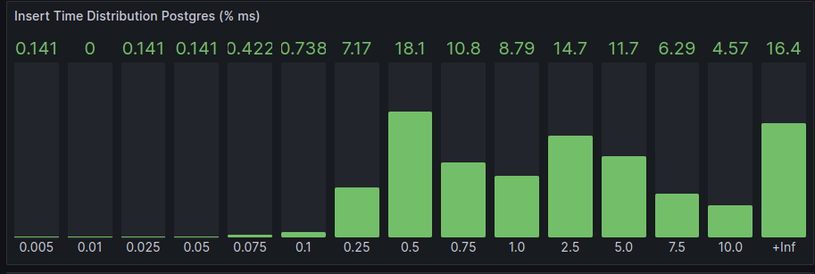

## Introduction

The *Nim Waku Node*, *nwaku*, has the capability of archiving messages until a certain limit (e.g. 30 days) so that other nodes can synchronize their message history throughout the *Store* protocol.

The *nwaku* originally used *SQLite* to archive messages but this has an impact on the node. *Nwaku* is single-threaded and therefore, any *SQLite* operation impacts the performance of other protocols, like *Relay.*

Therefore, the *Postgres* adoption is needed to enhance that.

[https://github.com/waku-org/nwaku/issues/1888](https://github.com/waku-org/nwaku/issues/1888)

## How to connect the *nwaku* to *Postgres*

Simply pass the next parameter to *nwaku*

```bash
--store-message-db-url="postgres://${POSTGRES_USER}:${POSTGRES_PASSWORD}@${POSTGRES_HOST}:${POSTGRES_PORT}/postgres
```

Notice that this only makes sense if the _nwaku_ has the _Store_ protocol mounted
```bash
--store=true
```

(start the _nwaku_ node with `--help` parameter for more _Store_ options)

## Examples of *nwaku* using *Postgres*

[https://github.com/waku-org/nwaku-compose](https://github.com/waku-org/nwaku-compose)

[https://github.com/waku-org/test-waku-query](https://github.com/waku-org/test-waku-query)

## Stress tests

The following repository was created as a tool to stress and compare performance between *nwaku*+*Postgres* and *nwaku*+*SQLite*:

[https://github.com/waku-org/test-waku-query](https://github.com/waku-org/test-waku-query)

### Insert test results

#### Maximum insert throughput

**Scenario**

- 1 node subscribed to pubsubtopic ‘x’ and the *Store* protocol mounted.
- ‘n’ nodes connected to the “store” node, and publishing messages simultaneously to pubsubtopic ‘x’.
- All nodes running locally in a *Dell Latitude 7640*.
- Each published message is fixed, 1.4 KB: [publish_one_client.sh](https://github.com/waku-org/test-waku-query/blob/master/sh/publish_one_client.sh)
- The next script is used to simulate multiple nodes publishing messages: [publish_multiple_clients.sh](https://github.com/waku-org/test-waku-query/blob/fe7061a21eb14395e723402face755c826077aec/sh/publish_multiple_clients.sh)

**Sought goal**

Find out the maximum number of concurrent inserts that both *SQLite* and *Postgres* could support, and check whether _Postgres_ behaves better than _SQLite_ or not.

**Conclusion**

Messages are lost after a certain threshold, and this message loss is due to limitations in the *Relay* protocol (GossipSub - libp2p.)

For example, if we set 30 nodes publishing 300 messages simultaneously, then 8997 rows were stored and not the expected 9000, in both *SQLite* and *Postgres* databases.

The reason why few messages were lost is because the message rate was higher than the *relay* protocol can support, and therefore a few messages were not stored. In this example, the test took 38.8’’, and therefore, the node was receiving 232 msgs/sec, which is much more than the normal rate a node will work with, which is ~10 msgs/sec (rate extracted from Grafana’s stats for the *status.prod* fleet.)

As a conclusion, the bottleneck is within the *Relay* protocol itself and not the underlying databases. Or, in other words, both *SQLite* and *Postgres* can support the maximum insert rate a Waku node will operate within normal conditions.

### Query test results (jmeter)

In this case, we are comparing *Store* performance by means of Rest service.

**Scenario**

- node_a: one _nwaku_ node with *Store* and connected to *Postgres.*
- node_b: one _nwaku_ node with *Store* and using *SQLite*.
- Both *Postgres* and *SQLite* contain +1 million rows.
- node_c: one _nwaku_ node with *REST* enabled and acting as a *Store client* for node_a.
- node_d: one _nwaku_ node with *REST* enabled and acting as a *Store client* for node_b.
- With _jmeter_, 10 users make *REST* *Store* requests concurrently to each of the “rest” nodes (node_c and node_d.)
- All _nwaku_ nodes running statusteam/nim-waku:v0.19.0

[This](https://github.com/waku-org/test-waku-query/blob/master/docker/jmeter/http_store_requests.jmx) is the _jmeter_ project used.


*Results*

With this, the *node_b* brings a higher throughput than the *node_a* and that indicates that the node that uses SQLite performs better. The following shows the measures taken by _jmeter_ with regard to the REST requests.


### Query test results (only Store protocol)

In this test suite, only the Store protocol is being analyzed, i.e. without REST. For that, a go-waku node is used, which acts as *Store* client. On the other hand, we have another go-waku app that publishes random *Relay* messages periodically. Therefore, this can be considered a more realistic approach.

The following diagram shows the topology used:


For that, the next apps were used:

1. [Waku-publisher.](https://github.com/alrevuelta/waku-publisher/tree/9fb206c14a17dd37d20a9120022e86475ce0503f) This app can publish Relay messages with different numbers of clients
2. [Waku-store-query-generator](https://github.com/Ivansete-status/waku-store-query-generator/tree/19e6455537b6d44199cf0c8558480af5c6788b0d). This app is based on the Waku-publisher but in this case, it can spawn concurrent go-waku Store clients.

That topology is defined in [this](https://github.com/waku-org/test-waku-query/blob/7090cd125e739306357575730d0e54665c279670/docker/docker-compose-manual-binaries.yml) docker-compose file.

Notice that the two `nwaku` nodes run the very same version, which is compiled locally.

#### Comparing archive SQLite & Postgres performance in [nwaku-b6dd6899](https://github.com/waku-org/nwaku/tree/b6dd6899030ee628813dfd60ad1ad024345e7b41)

The next results were obtained by running the docker-compose-manual-binaries.yml from [test-waku-query-c078075](https://github.com/waku-org/test-waku-query/tree/c07807597faa781ae6c8c32eefdf48ecac03a7ba) in the sandbox machine (metal-01.he-eu-hel1.misc.wakudev.status.im.)

**Scenario 1**

**Store rate:** 1 user generating 1 store-req/sec.

**Relay rate:** 1 user generating 10msg/sec, 10KB each.

In this case, we can see that the SQLite performance is better regarding the store requests.


The following graph shows how the *SQLite* node has blocking periods whereas the *Postgres* always gives a steady rate.


**Scenario 2**

**Store rate:** 10 users generating 1 store-req/sec.

**Relay rate:** 1 user generating 10msg/sec, 10KB each.

In this case, is more evident that the *SQLite* performs better.


**Scenario 3**

**Store rate:** 25 users generating 1 store-req/sec.

**Relay rate:** 1 user generating 10msg/sec, 10KB each.

In this case, the performance is similar regarding the timings. The store rate is bigger in *SQLite* and *Postgres* keeps the same level as in scenario 2.


#### Comparing archive SQLite & Postgres performance in [nwaku-b452ed8](https://github.com/waku-org/nwaku/tree/b452ed865466a33b7f5b87fa937a8471b28e466e)

This nwaku commit is after a few **Postgres** optimizations were applied.

The next results were obtained by running the docker-compose-manual-binaries.yml from [test-waku-query-c078075](https://github.com/waku-org/test-waku-query/tree/c07807597faa781ae6c8c32eefdf48ecac03a7ba) in the sandbox machine (metal-01.he-eu-hel1.misc.wakudev.status.im.)

**Scenario 1**

**Store rate** 1 user generating 1 store-req/sec. Notice that the current Store query used generates pagination which provokes more subsequent queries than the 1 req/sec that would be expected without pagination.

**Relay rate:** 1 user generating 10msg/sec, 10KB each.


It cannot be appreciated but the average *****Store***** time was 11ms.

**Scenario 2**

**Store rate:** 10 users generating 1 store-req/sec. Notice that the current Store query used generates pagination which provokes more subsequent queries than the 10 req/sec that would be expected without pagination.

**Relay rate:** 1 user generating 10msg/sec, 10KB each.


**Scenario 3**

**Store rate:** 25 users generating 1 store-req/sec. Notice that the current Store query used generates pagination which provokes more subsequent queries than the 25 req/sec that would be expected without pagination.

**Relay rate:** 1 user generating 10msg/sec, 10KB each.


#### Conclusions

After comparing both systems, *SQLite* performs much better than *Postgres* However, a benefit of using *Postgres* is that it performs asynchronous operations, and therefore doesn’t consume CPU time that would be better invested in *Relay* for example.

Remember that _nwaku_ is single-threaded and *chronos* performs orchestration among a bunch of async tasks, and therefore it is not a good practice to block the whole _nwaku_ process in a query, as happens with *SQLite*

After applying a few *Postgres* enhancements, it can be noticed that the use of concurrent *Store* queries doesn’t go below the 250ms barrier. The reason for that is that most of the time is being consumed in [this point](https://github.com/waku-org/nwaku/blob/6da1aeec5370bb1c116509e770178cca2662b69c/waku/common/databases/db_postgres/dbconn.nim#L124). The `libpqisBusy()` function indicates that the connection is still busy even the queries finished.

Notice that we usually have a rate below 1100 req/minute in _status.prod_ fleet (checked November 7, 2023.)

-----------------------------

### Multiple nodes & one single database

This study aims to look for possible issues when having only one single database while several Waku nodes insert or retrieve data from it.
The following diagram shows the scenery used for such analysis.


There are three nim-waku nodes that are connected to the same database and all of them are trying to write messages to the same _PostgreSQL_ instance. With that, it is very common to see errors like:
```
ERR 2023-11-27 13:18:07.575+00:00 failed to insert message                   topics="waku archive" tid=2921 file=archive.nim:111 err="error in runStmt: error in dbConnQueryPrepared calling waitQueryToFinish: error in query: ERROR:  duplicate key value violates unique constraint \"messageindex\"\nDETAIL:  Key (storedat, id, pubsubtopic)=(1701091087417938405, 479c95bbf74222417abf76c7f9c480a6790e454374dc4f59bbb15ca183ce1abd, /waku/2/default-waku/proto) already exists.\n
```

The `db-postgres-hammer` is aimed to stress the database from the `select` point of view. It performs `N` concurrent `select` queries with a certain rate.

#### Results

The following results were obtained by using the sandbox machine (metal-01.he-eu-hel1.misc.wakudev) and running nim-waku nodes from https://github.com/waku-org/nwaku/tree/b452ed865466a33b7f5b87fa937a8471b28e466e and using the `test-waku-query` project from https://github.com/waku-org/test-waku-query/tree/fef29cea182cc744c7940abc6c96d38a68739356

The following shows the results

1. Two `nwaku-postgres-additional` inserting messages plus 50 `db-postgres-hammer` making 10 `selects` per second.


2. Five `nwaku-postgres-additional` inserting messages plus 50 `db-postgres-hammer` making 10 `selects` per second.



In this case, the insert time gets more spread because the insert operations are shared amongst five more nodes. The _Store_ query time remains the same on average.

3. Five `nwaku-postgres-additional` inserting messages plus 100 `db-postgres-hammer` making 10 `selects` per second.
This case is similar to 2. but stressing more the database.


