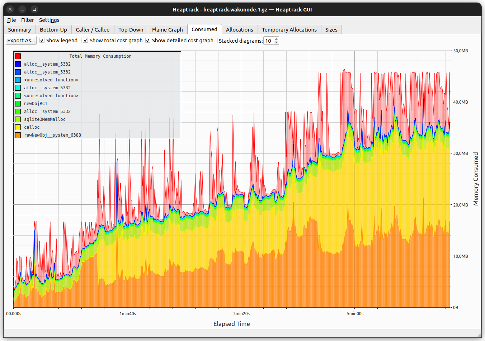

# Heaptrack in Nim Waku

## Background
Given that RAM is a limited resource, it is crucial to have a good insight on what is going on with the memory used by a particular process.

## Heaptrack
Heaptrack is a tool that allows to generate memory usage reports.
It operates in two modes:
- preload: the tracking is made from the beginning.
- inject: the tracking starts at a certain time by attaching to a running process.

### Building Heaptrack (tried on Ubuntu)
- `git clone git@github.com:KDE/heaptrack.git`
- `mkdir build; cd build`
- `cmake ..`
   At this point, make sure the cmake doesn't complain about any missing dependency.
   Among others, the most tricky deps are obtained by the next commands:
   - `sudo apt install libkf5i18n-dev`
   - `sudo apt install libkf5itemmodels-dev`
   - `sudo apt install libkf5threadweaver-dev`
   - `sudo apt install libkf5service-dev`
   - `sudo apt install libkf5completion-dev`
   - `sudo apt install libkf5itemviews-dev`
   - `sudo apt install libkf5jobwidgets-dev`
   - `sudo apt install libkf5solid-dev`
   - `sudo apt install libkf5coreaddons-dev`
   - `sudo apt install libkf5auth-dev`
   - `sudo apt install libkf5codecs-dev`
   - `sudo apt install libkf5configwidgets-dev`
   - `sudo apt install libkf5xmlgui-dev`
   - `sudo apt install libkf5widgetsaddons-dev`
   - `sudo apt install libqt5gui5`
   - `sudo apt install libkf5kio-dev`
   - `sudo apt install libkf5iconthemes-dev`
- `make`
- On completion, the `bin/heaptrack_gui` and `bin/heaptrack` binaries will get generated.
    - heaptrack: needed to generate the report.
    - heaptrack_gui: needed to analyse the report.

## Heaptrack & Nwaku
nwaku supports heaptrack but it needs a special compilation setting.

### Patch Nim compiler to register allocations on Heaptrack

Currently we are rely on official Nim repository. So we need to patch the Nim compiler to register allocations and deallocations on Heaptrack.
For Nim 2.2.4 version we created a patch that can be applied as:
```bash
git apply --directory=vendor/nimbus-build-system/vendor/Nim docs/tutorial/nim.2.2.4_heaptracker_addon.patch
git add .
git commit -m "Add heaptrack support to Nim compiler - temporary patch"
```

> We are never going to merge this patch into the official Nim repository, so it is important to keep it in the `nimbus-build-system` repository.
> Commit ensures that `make update` will not override the patch unintentionally.

> We are planning to make it avail through an official PR for Nim.

When the patch is applied we can build wakunode2 with heaptrack support.

### Build nwaku with heaptrack support

`make -j<nproc> HEAPTRACKER=1 wakunode2`

### Create nwaku memory report with heaptrack

nwaku only works correctly with heaptrack operating in 'preload' mode, i.e. the memory is tracked from the beginning.
To achieve this, the `heaptrack` binary should be prepended to the usual `wakunode`:

e.g.:
`<base_heaptrack_folder>/build/bin/heaptrack <base_nwaku_folder>/build/wakunode2 ...`

While the above is running, a file with the next format is being populated with allocs/deallocs stats in the current folder:

 ```
 heaptrack.<process_name>.<pid>.gz
e.g.:
 heaptrack.wakunode2.23125.gz
 ```

### Build a Docker image with Heaptrack + Nim Waku
Having Docker properly installed in your machine, do the next:

- cd to the `nwaku` root folder.
- ```sudo make docker-image DOCKER_IMAGE_NAME=docker_repo:docker_tag HEAPTRACKER=1```
- alternatively you can use the `docker-quick-image` target, this is faster but creates an ubuntu based image, so your local build environment must match.

That will create a Docker image with both nwaku and heaptrack. The container's entry point is `ENTRYPOINT ["/heaptrack/build/bin/heaptrack", "/usr/bin/wakunode"]`, so the memory report starts being generated from the beginning.

#### Notice for using heaptrack supporting image with `docker compose`

Take case of the wakunode2 should started as
```
exec /heaptrack/build/bin/heaptrack /usr/bin/wakunode\
... all the arguments you want to pass to wakunode ...
```

### Extract report file from a running Docker container
Bear in mind that if you restart the container, the previous report will get lost. Therefore, before restarting, it is important to extract it from the container once you consider it has enough information.

While the Docker container is running, run the next command:
```
sudo docker cp 768e7de52d3c:/heaptrack.wakunode.1.gz .
```
(replace the 768.. with your docker container id.).

### Analyse a heaptrack report
```
<heaptrack_base_folder>/bin/heaptrack_gui heaptrack.wakunode.1.gz
```

You should be able to see memory allocations. It is important
to see a legend like shown below:


sudo make docker-image DOCKER_IMAGE_NAME=docker_repo:docker_tag HEAPTRACKER=1
