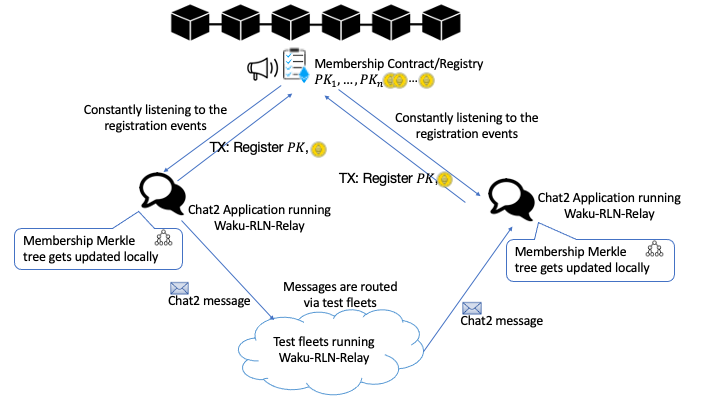

# Spam-protected chat2 application with on-chain group management

This document is a tutorial on how to run the chat2 application in the spam-protected mode using the Waku-RLN-Relay protocol and with dynamic/on-chain group management.
In the on-chain/dynamic group management, the state of the group members i.e., their identity commitment keys is moderated via a membership smart contract deployed on the Sepolia network which is one of the Ethereum test-nets.
Members can be dynamically added to the group and the group size can grow up to 2^20 members.
This differs from the prior test scenarios in which the RLN group was static and the set of members' keys was hardcoded and fixed.


## Prerequisites
To complete this tutorial, you will need

1. An rln keystore file with credentials to the rln membership smart contract you wish to use. You may obtain this by registering to the smart contract and generating a keystore, or by using the [rln-keystore-generator](./rln-keystore-generator.md) which does that for you.


## Overview
Figure 1 provides an overview of the interaction of the chat2 clients with the test fleets and the membership contract.
At a high level, when a chat2 client is run with Waku-RLN-Relay mounted in on-chain mode.

Under the hood, the chat2 client constantly listens to the membership contract and keeps itself updated with the latest state of the group.

In the following test setting, the chat2 clients are to be connected to the Waku test fleets as their first hop.
The test fleets will act as routers and are also set to run Waku-RLN-Relay over the same pubsub topic and content topic as chat2 clients i.e., the default pubsub topic of `/waku/2/rs/0/0` and the content topic of `/toy-chat/3/mingde/proto`.
Spam messages published on the said combination of topics will be caught by the test fleet nodes and will not be routed.
Note that spam protection does not rely on the presence of the test fleets.
In fact, all the chat2 clients are also capable of catching and dropping spam messages if they receive any.
You can test it by connecting two chat2 clients (running Waku-RLN-Relay) directly to each other and see if they can spot each other's spam activities.

 
 Figure 1.

# Set up
## Build chat2
First, build chat2

```bash
make chat2
```

## Set up a chat2 client

Run the following command to set up your chat2 client.

```bash
./build/chat2 --fleet:test \
--content-topic:/toy-chat/3/mingde/proto \
--rln-relay:true \
--rln-relay-dynamic:true \
--rln-relay-eth-contract-address:0xF471d71E9b1455bBF4b85d475afb9BB0954A29c4 \
--rln-relay-cred-path:xxx/xx/rlnKeystore.json \
--rln-relay-cred-password:xxxx \
--rln-relay-eth-client-address:xxxx \
--ports-shift:1
```

In this command
- the `--fleet:test` indicates that the chat2 app gets connected to the test fleets.
- the `toy-chat/3/mingde/proto` passed to the `content-topic` option indicates the content topic on which the chat2 application is going to run.
- the `rln-relay` flag is set to `true` to enable the Waku-RLN-Relay protocol for spam protection.
- the `--rln-relay-dynamic` flag is set to `true` to enable the on-chain mode of Waku-RLN-Relay protocol with dynamic group management.
- the `--rln-relay-eth-contract-address` option gets the address of the membership contract.
 The current address of the contract is `0xF471d71E9b1455bBF4b85d475afb9BB0954A29c4`.
 You may check the state of the contract on the [Sepolia testnet](https://sepolia.etherscan.io/address/0xF471d71E9b1455bBF4b85d475afb9BB0954A29c4).
- the `--rln-relay-cred-path` option denotes the path to the keystore file described above
- the `--rln-relay-cred-password` option denotes the password to the keystore
- the `rln-relay-eth-client-address` is the WebSocket address of the hosted node on the Sepolia testnet.
 You need to replace the `xxxx` with the actual node's address.

For `rln-relay-eth-client-address`, if you do not know how to obtain it, you may use the following tutorial on the [prerequisites of running on-chain spam-protected chat2](./pre-requisites-of-running-on-chain-spam-protected-chat2.md).

You may set up more than one chat client,
just make sure that you increment the `--ports-shift` value for each new client you set up e.g., `--ports-shift=2`.

Once you run the command, you are asked to choose your nickname:
```
Choose a nickname >> Alice
```

then you will see a couple of other messages related to setting up the connections of your chat app,
the content may differ on your screen though:
```
Connecting to test fleet using DNS discovery...
Discovered and connecting to @[16Uiu2HAkzHaTP5JsUwfR9NR8Rj9HC24puS6ocaU8wze4QrXr9iXp, 16Uiu2HAkykgaECHswi3YKJ5dMLbq2kPVCo89fcyTd38UcQD6ej5W, 16Uiu2HAmDCp8XJ9z1ev18zuv8NHekAsjNyezAvmMfFEJkiharitG]
Listening on
 /ip4/75.157.120.249/tcp/60001/p2p/16Uiu2HAmQXuZmbjFWGagthwVsPFrc5ZrZ9c53qdUA45TWoZaokQn
Store enabled, but no store nodes configured. Choosing one at random from discovered peers
Connecting to storenode: 16Uiu2HAkzHaTP5JsUwfR9NR8Rj9HC24puS6ocaU8wze4QrXr9iXp
```
You will  also see some historical messages being fetched, again the content may be different on your end:

```
<Jul 26, 10:41> Bob: hi
<Jul 26, 10:41> Bob: hi
<Jun 29, 16:21> Alice: spam1
<Jun 29, 16:21> Alice: hiiii
<Jun 29, 16:21> Alice: hello
<Jun 29, 16:19> Bob: hi
<Jun 29, 16:19> Bob: hi
<Jun 29, 16:19> Alice: hi
<Jun 29, 16:15> b: hi
<Jun 29, 16:15> h: hi
...
```

Next, you see the following message:
```
rln-relay preparation is in progress ...
```
Also, the registered RLN identity key, the RLN identity commitment key, and the index of the registered credential will be displayed as given below.
Note that in the figure, the RLN identity key is not shown for security reasons (replaced by a string of `x`s).
But, you will see your RLN identity key.

```
your membership index is: xx
your RLN identity key is: xxxxxxxxxxxxxxxxxxxxxxxxxxxxxxxxxxxxxxxxxxxxxxxxxxxxxxxxxxxxxxxx
your RLN identity commitment key is: 6c6598126ba10d1b70100893b76d7f8d7343eeb8f5ecfd48371b421c5aa6f012
```

Finally, the chat prompt `>>` will appear which means your chat2 client is ready.
Once you type a chat line and hit enter, you will see a message that indicates the epoch at which the message is sent e.g.,

```
>> Hi
--rln epoch: 165886530
<Jul 26, 12:55> Alice: Hi
```
The numerical value `165886530` indicates the epoch of the message `Hi`.
You will see a different value than `165886530` on your screen.
If two messages sent by the same chat2 client happen to have the same RLN epoch value, then one of them will be detected as spam and won't be routed (by test fleets in this test setting).
At the time of this tutorial, the epoch duration is set to `10` seconds.
You can inspect the current epoch value by checking the following [constant variable](https://github.com/waku-org/nwaku/blob/44c543129ee4149255a00a05f1e7d21f8fa28626/waku/v2/waku_rln_relay/constants.nim#L51) in the nim-waku codebase.
Thus, if you send two messages less than `10` seconds apart, they are likely to get the same `rln epoch` values.

After sending a chat message, you may experience some delay before the next chat prompt appears.
The reason is that under the hood a zero-knowledge proof is being generated and attached to your message.


Try to spam the network by violating the message rate limit i.e.,
sending more than one message per epoch.
Your messages will be routed via test fleets that are running in spam-protected mode over the same content topic i.e., `/toy-chat/3/mingde/proto` as your chat client.
Your spam activity will be detected by them and your message will not reach the rest of the chat clients.
You can check this by running a second chat user and verifying that spam messages are not displayed as they are filtered by the test fleets.
Furthermore, the chat client will prompt you with the following warning message indicating that the message rate is being violated:
```
⚠️ message rate violation! you are spamming the network!
```
A sample test scenario is illustrated in the [Sample test output section](#sample-test-output).

Once you are done with the test, make sure you close all the chat2 clients by typing the `/exit` command.
```
>> /exit
quitting...
```


# Sample test output
In this section, a sample test of running two chat clients is provided.
Note that the value used for `rln-relay-eth-client-address` in the following code snippets is junk and not valid.

The two chat clients namely `Alice` and `Bob` are connected to the test fleets.
`Alice` sends 4 messages i.e., `message1`, `message2`, `message3`, and `message4`.
However, only three of them reach `Bob`.
This is because the two messages `message2` and `message3` have identical RLN epoch values, so, one of them gets discarded by the test fleets as a spam message.
The test fleets do not relay `message3` further, hence `Bob` never receives it.
You can check this fact by looking at `Bob`'s console, where `message3` is missing.


**Alice**
```bash
./build/chat2 --fleet:test --content-topic:/toy-chat/3/mingde/proto --rln-relay:true --rln-relay-dynamic:true --rln-relay-eth-contract-address:0xF471d71E9b1455bBF4b85d475afb9BB0954A29c4 --rln-relay-cred-path:rlnKeystore.json --rln-relay-cred-password:password --rln-relay-eth-client-address:https://sepolia.infura.io/v3/12345678901234567890123456789012 --ports-shift=1
```

```
Choose a nickname >> Alice
Welcome, Alice!
Connecting to test fleet using DNS discovery...
Discovered and connecting to @[16Uiu2HAkzHaTP5JsUwfR9NR8Rj9HC24puS6ocaU8wze4QrXr9iXp, 16Uiu2HAkykgaECHswi3YKJ5dMLbq2kPVCo89fcyTd38UcQD6ej5W, 16Uiu2HAmDCp8XJ9z1ev18zuv8NHekAsjNyezAvmMfFEJkiharitG]
Listening on
 /ip4/75.157.120.249/tcp/60001/p2p/16Uiu2HAmH7XbkcdbA1CCs91r93HuwZHSdXppCNvJTDVvgGhuxyuG
Store enabled, but no store nodes configured. Choosing one at random from discovered peers
Connecting to storenode: 16Uiu2HAkzHaTP5JsUwfR9NR8Rj9HC24puS6ocaU8wze4QrXr9iXp
<Jul 26, 10:41> Bob: hi
<Jul 26, 10:41> Bob: hi
<Jun 29, 16:21> Alice: spam1
<Jun 29, 16:21> Alice: hiiii
<Jun 29, 16:21> Alice: hello
<Jun 29, 16:19> Bob: hi
<Jun 29, 16:19> Bob: hi
<Jun 29, 16:19> Alice: hi
<Jun 29, 16:15> b: hi
<Jun 29, 16:15> h: hi
rln-relay preparation is in progress ...
your membership index is: xx
your rln identity key is: xxxxxxxxxxxxxxxxxxxxxxxxxxxxxxxxxxxxxxxxxxxxxxxxxxxxxxxxxxxxxxxx
your rln identity commitment key is: bd093cbf14fb933d53f596c33f98b3df83b7e9f7a1906cf4355fac712077cb28
>> message1
--rln epoch: 165886591
<Jul 26, 13:05> Alice: message1
>> message2
--rln epoch: 165886592
<Jul 26, 13:05> Alice: message2
>> message3
--rln epoch: 165886592 ⚠️ message rate violation! you are spamming the network!
<Jul 26, 13:05> Alice: message3
>> message4
--rln epoch: 165886593
<Jul 26, 13:05> Alice: message4
>>
```

**Bob**
```bash
./build/chat2 --fleet:test --content-topic:/toy-chat/3/mingde/proto --rln-relay:true --rln-relay-dynamic:true --rln-relay-eth-contract-address:0xF471d71E9b1455bBF4b85d475afb9BB0954A29c4 --rln-relay-cred-path:rlnKeystore.json --rln-relay-cred-index:1 --rln-relay-cred-password:password --rln-relay-eth-client-address:https://sepolia.infura.io/v3/12345678901234567890123456789012 --ports-shift=2
```

```
Choose a nickname >> Bob
Welcome, Bob!
Connecting to test fleet using DNS discovery...
Discovered and connecting to @[16Uiu2HAkzHaTP5JsUwfR9NR8Rj9HC24puS6ocaU8wze4QrXr9iXp, 16Uiu2HAkykgaECHswi3YKJ5dMLbq2kPVCo89fcyTd38UcQD6ej5W, 16Uiu2HAmDCp8XJ9z1ev18zuv8NHekAsjNyezAvmMfFEJkiharitG]
Listening on
 /ip4/75.157.120.249/tcp/60002/p2p/16Uiu2HAmE7fPUWGJ7UFJ3p2a3RNiEtEvAWhpfUStcCDmVGhm4h4Z
Store enabled, but no store nodes configured. Choosing one at random from discovered peers
Connecting to storenode: 16Uiu2HAkzHaTP5JsUwfR9NR8Rj9HC24puS6ocaU8wze4QrXr9iXp
rln-relay preparation is in progress ...
your membership index is: xx
your rln identity key is: xxxxxxxxxxxxxxxxxxxxxxxxxxxxxxxxxxxxxxxxxxxxxxxxxxxxxxxxxxxxxxxx
your rln identity commitment key is: d4961a7681521730bc7f9ade185c632b94b70624b2e87e21a97c07b83353f306
>> <Jul 26, 13:05> Alice: message1
>> <Jul 26, 13:05> Alice: message2
>> <Jul 26, 13:05> Alice: message4
>>
```
