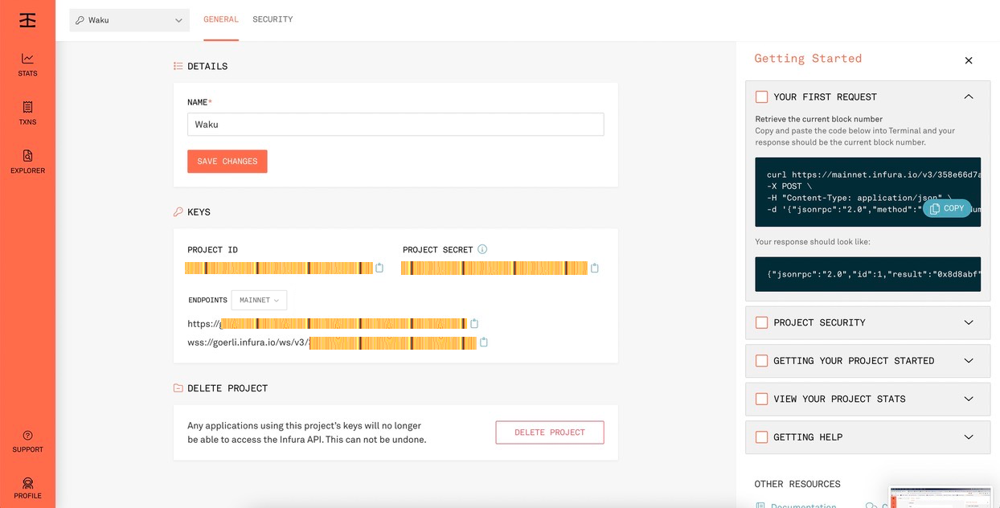

In this tutotial you will learn how to:
1. Create Sepolia Ethereum Account and obtain its private key.
2. Obtain Sepolia Ethers from faucet.
3. Set up a hosted node on Sepolia Testnet using Infura.

If you already have an Ethereum account with sufficient ethers on the Sepolia testnet then you can skip the first two sections.
## Creating Sepolia Ethereum Account and obtaining its private key

1. Download and install Metamask. [https://metamask.io/download/](https://metamask.io/download/)
2. Create a new wallet and save your secret recovery key.
    
    

3. Login to Metamask.
    
    

4. You should already see an account created. As you can see on top right, it should be pointing to Ethereum mainnet.
    
    

5. You can use the same account for different networks. For Waku we need to connect to the Sepolia test network.
6. You can switch to a test network by clicking on the drop down menu. Select Sepolia test network for Waku:

    

7. Click on Show/hide test networks.
8. Enable “Show Test Networks".
    
    
    
    

9. Close the settings and now you should see the test networks in the drop down on the top right.
    
    

10. Switch to Sepolia Test Network.
11. You can see that the same account can be used with different networks. But note that the ETH balance on different networks are different and are different tokens.
    
    

12. Now to export your private key for the account, if needed, please click on the three dots beside the account.
    
    

13. Click on Account Details.
14. Click on Export Private Key.
    
    

15. Enter your Metamask password when prompted.
    
    

16. You will be shown the private key. Copy it as needed.

Obtain Sepolia Ethers from faucet
---

1. Ethers on Sepolia test networks can be obtained from different faucets.
2. One of the faucets is as follows:
    1. [https://sepoliafaucet.com//](https://sepoliafaucet.com/)
    (NOTE: We have not tested the security of these faucets so please feel free to do your own research or obtain Sepolia ethers from other faucets if needed.)
3. Please follow the instructions on the webpages of these faucets.
4. A lot of faucets limit the Sepolia ETH to 0.05 ETH/day.
5. To obtain more eth, you can do some POW mining. One of those POW faucet is:
     [https://sepolia-faucet.pk910.de/](https://sepolia-faucet.pk910.de/)
6. Enter your Eth account address, accept Captcha and start mining.
    
    

7. You can see the estimated Sepolia ETH mined per hour. Each session is restricted to a few hours.
    
    

8. When you exceed the hour limit of the session, then the mining will be stopped.
9. Alternatively, stop the mining when mined enough sepolia ether.
10. Do not forget to claim your sepolia ether.
    
    
    
    
Setting up a hosted node on Sepolia Testnet using Infura
---

(Note: Infura provides a simple straight-forward way of setting up endpoints for interaction with the Ethereum chain and the Waku RLN smart contract without having to run a dedicated Ethereum node. Setting up infura is not mandatory. Operators concerned with the centralized aspect introduced by infura can setup their own node.)

1. Sign up to infura if you do not have an account already. [https://infura.io/register](https://infura.io/register)
    
    

2. After registering and verifying the account, create a new project using Ethereum and give it a name.
    
    

3. After creating the project, you will be presented with a dashboard like follows. Note that your Project Id and secret will be different.
    
   

4. Select Sepolia network in Endpoints.
    
    

5. You can find the endpoints for the hosted node using https and wss. The wss endpoint is the relevant one for connecting the waku node to the RLN contract on Sepolia network. Like follows:
    
    

6. You can change security settings or view usage options as required in the dashboard.
7. Congratulations, you are now ready to use the Infura node.
